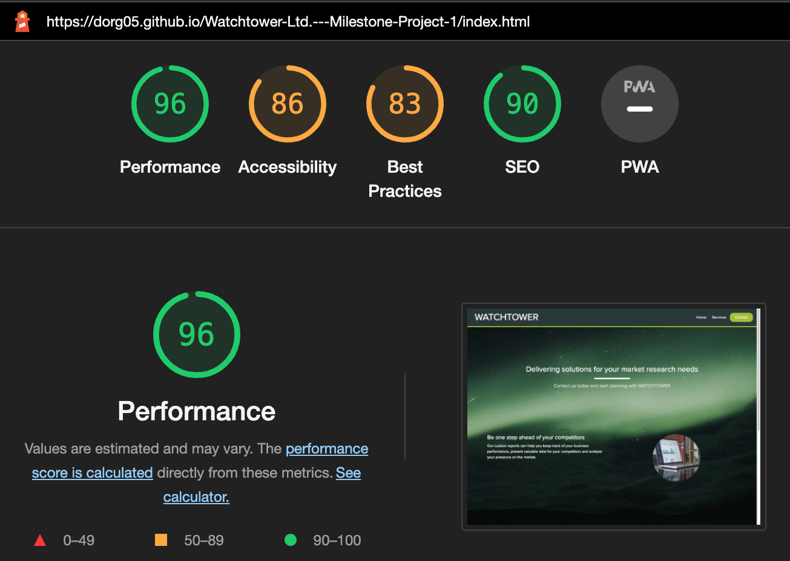

# Watchtower Limited Website
Watchtower Limited is a fictional market research agency offering services to both individuals and businesses.

It is targeted toward people who are looking to gain a better understanding of a particular service or product that is offered on the market.

# Table of contents
1. User Experience (UX)
* Project Goals
* Business Goals
* Customer Goals
* User Stories
2. Design Choices
* Images Used
* Colours Used
* Typography
3. Wireframes
4. Features
* Existing Features
* Features to be implemented in the future
5. Technologies Used
* Languages Used
* Frameworks and Libraries Used
6. Testing
* Validator Testing
* Manual Testing
* Lighthouse Testing
* Known Bugs
7. Deployment
* How the site was deployed
* How to mirror this repository
8. Credits
* Content
* Code
* Media

# User Experience (UX)
* Project Goals

   The main goal of this project is to create a digital presence for the (fictional) established research agency Watchtower Limited. The website should be easy to navigate and should provide a comprehensive structure of the services offered.

* Business Goals

    The primary goal of the business is to reach new clients in order to sell its market research services. The business has determined that the best way to find new clients is by creating a website.

* Client Goals

    To find a reliable company that offers market research services online.

* User Stories

    First time visitors should be able to:
    - Get a quick understanding of what the website is about and the offered services.
    - Seamlessly navigate between the three website pages.
    - Easily be able to contact the business via form.
    - Understand where the business is located.

    Returning visitors should be able to:

    - Find the information they need from any of the three pages at a glance
    - Find the business' social links or email

 # Design Choices
* Images Used

  The main background image has been chosen because it is beautiful and profound and fits well with the website interior. The background image also scales quite well on all device screens. The dark colours are easy on the eye and give the site a professional look, while also helping to highlight the quality of the services provided. 
  The other images aim to highlight the business readiness of the company. 
  The client logo images are put on the front page to catch the eye of the new site visitor, showing that the business has worked with big companies.

* Colours Used

    The colour palette used for this website was chosen to fit well with the main background image, which is a dark green colour.
    The selected colours are all dark and therefore, easy on the eyes of the user.
    The chosen palette can be found [here](https://palettes.shecodes.io/palettes/1225)

    

* Typography
    The main body font is Roboto - a simple yet sophisticated font that seems very clean and professional. Google Fonts was used to import this font into the css file.

 # Wireframes
 * Home Page Wireframes

 * Services Page Wireframes

 * Contact Page Wireframes

# Features
### Existing features
* F01 Navbar - The first item on the navigation bar is a Logo (on the lefthand side) with a link to the Home page. There are two other links on the right - Home and Services. The Contact button is a link to the Contact page. The navbar is responsive and takes different shapes on the three device screens.

* F02 Description - Landing Page. Description section on the landing page is the first thing the new visitor sees on the website. It has a straight-forward business motto, which gets the reader thinking about market research. Below that is a call to action (Be one step ahead of your competitors) accompanied by some descriptive text about the business. There is also a research-oriented image on the righthand side.

* F03 Capabilities section - this section is constructed of two main elements - a call to action suggesting the reader to keep scrolling and three boxes containing some highlights of the business.

* F04 Client Highlights - The four biggest clients of Watchtower Ltd. Their logos are put on the home page to impress the site visitor.

* F05 Footer - A simple footer consisting the company name, two links to the Services and Contact pages and some social links.

* F06 Services Section - shows the main market research services that are offered by the business. This section should be the most valuable to new site visitors because it lists all services that the client may be looking for.

* F07 Pricing Section - gives the site visitor a comprehensive view of the different plans offered by Watchtower Ltd. The third plan is a custom plan, therefore the quote for it will be received upon contacting the business.

* F08 Statistics - These three boxes aim to highlight the biggest achievements by the business to date.

* F09 Contact Form - The contact form on this section is one of the most important elements on the website, since it will be the main method of contact for new customers. The contact form consists of 4 fields and is responsive on all devices.

* F10 Address Details - This box shows the physical address of the business, while also giving description about the exact address, email and company registration number of the business (all fictional).

### Features to be implemented in the future

Possible features include:

* Online purchasing option
* About us section for each team member

# Technologies Used
* Languages Used
  - HTML5
  - CCS3
* Frameworks and Libraries Used
  - Bootstrap5 was used for custom CSS styling and layout design
  - Font Awesome was used for icons and design
  - Balsamiq was used for creating the Wireframes
  - Google Fonts was used for text styling
  - Git was used for version control. Gitpod was used to push the code to GitHub.
  - GitHub was used for code repository after the code was pushed from Git.

  # Testing

### Validator Testing 
  * HTML Validator [Link](https://validator.w3.org/)
  - index.html results
  
  - services.html results
  
  - contact.html results
  
  * CSS Validator [Link](https://jigsaw.w3.org/css-validator/)
  

### Manual Testing
  * I have tested the website for responsiveness in Chrome Developer Tools. The website responds well on all three device screens. The website works best on Iphone 12 Pro screen for mobile, Ipad Air for Tablet and larger (desktop) screens.

### Lighthouse
  * I have used Lighthouse in Chrome Developer tools to measure my website loading time, performance, accessibility, best practices and SEO. The results are shown below
   - Home page results
   
   - Services page results
   
   - Contact page results
   

### Known Bugs

* On the Services Page in between 1150x860 - 1324x860 resolution my pricing heading breaks. I didn't manage to fix this by myself.

* On all three pages in between 575x1178 and 765x1178 my footer doesn't look as expected.

# Deployment
## How the site was deployed
* To deploy this website on GitHub Pages:
* In GitHub uder the Dorg05/Watchtower-Ltd.---Milestone-Project-1 repository, choose the Settings tab
* On the left side choose Pages
* From the "Build and Deployment Section" select the "main" branch then "/root" and click "Save"
* Refresh the page. A notification will be shown above saying that the website is live
* The live link to the website can be found here - [Watchtower](https://dorg05.github.io/Watchtower-Ltd.---Milestone-Project-1/)
## How to mirror this repository
* Navigate to the Dorg05/Watchtower-Ltd.---Milestone-Project-1 repository in GitHub
* Click "GitPod" on the righthand side
* When your new workspace opens navigate to the command line below
* Type in "git push --mirror https: // github .com /EXAMPLE- USER/NEW- REPOSITORY .git"
* The whole project will be pushed to your new GitHub repository

# Credits
## Content
* The website idea was loosely based on a german marketing research website - Researchly [Link](https://www.researchly.at/)
* All other content was created by the developer

## Code
* Code in the "Services" page was very similar to the code from the Love Running project [Link](https://learn.codeinstitute.net/courses/course-v1:CodeInstitute+CSE101+2020_Q2/courseware/be0e510a3aca4bccb6e0bba4cf7cf06b/6eb8cfc87bfd434a87861a844e00b655/)
* Code for my client logos in the "Home" page was based on a tutorial from Stackoverflow found here [Link](https://stackoverflow.com/questions/64857957/how-to-create-a-responsive-client-logo-gallery)
* Code for importing the google map into my "Contact" page was based on a tutorial in W3Schools [Link](https://www.w3schools.blog/html-google-maps)
* Code for telephone details in the contact form was copied from W3Schools [Link](https://www.w3schools.com/tags/att_input_type_tel.asp)

## Media
* Icons throughout the website were imported from FontAwesome [Link](https://fontawesome.com/)
* The palette of colours used can be found on this website [Link](https://palettes.shecodes.io/palettes/1225)
* The Roboto font was imported from Google Fonts [Link](https://fonts.google.com/)
* Images in the Readme.md file were cropped from the main website and imported using Balsamiq [Link](https://balsamiq.com/)
* Images in the website were downloaded from Unsplash [Link](https://unsplash.com/)
  - Main Image (Skylight) is uploaded to Unsplash by Lucija Ros and can be found [here](https://unsplash.com/photos/SxNX66JAFHI)
  - Laptop image on Home page is uploaded to Unsplash by Carlos Muza and can be found [here](https://unsplash.com/photos/hpjSkU2UYSU)
  - Image on the Services Page is uploaded to Unsplash and can be found [here](https://vui.unsplash.com/resize?height=256&quality=60&type=auto&url=https%3A%2F%2Fsearched-images.s3.us-west-2.amazonaws.com%2Ff84ca45c-6001-44cd-8e29-9b1827091ccf%3FX-Amz-Algorithm%3DAWS4-HMAC-SHA256%26X-Amz-Credential%3DAKIAQ4GRIA4Q6KECABEK%252F20230228%252Fus-west-2%252Fs3%252Faws4_request%26X-Amz-Date%3D20230228T102539Z%26X-Amz-Expires%3D86400%26X-Amz-SignedHeaders%3Dhost%26X-Amz-Signature%3D59ea9882f034c83c2d22d0fadaed200ab3f300288809ff983b2f765d32b2a50d&sign=avSpNXrmpOsjWq-QQFfu46UoCqOmkCCej7EEOlnuq-Q)
* Images in the Client Logos Section can be found on google images [Link](https://www.google.com/imghp?hl=EN)
  - Microsoft logo can be found [here](https://commons.wikimedia.org/wiki/File:Microsoft_logo.svg)
  - RyanAir logo can be found [here](https://bg.wikipedia.org/wiki/%D0%A4%D0%B0%D0%B9%D0%BB:Arpa_Ryanair.png)
  - Welsh Government logo can be found [here](https://assets.wales.com/)
  - Apple logo can be found [here](https://toppng.com/free-image/apple-logo-logo-png-transparent-background-PNG-free-PNG-Images_475769)

